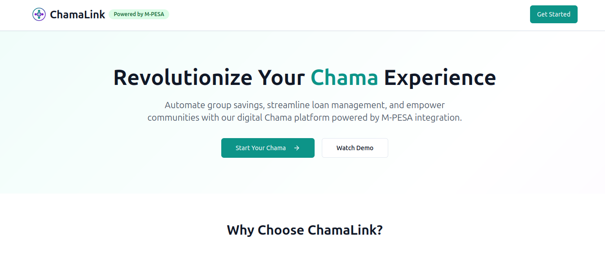

# ChamaLink - Digital Chama Management Platform

<div align="center">



**Revolutionizing Community Savings and Group Finance in Kenya**

[](https://choosealicense.com/licenses/mit/)
[](https://www.typescriptlang.org/)
[](https://reactjs.org/)
[](https://supabase.com/)
[](https://www.safaricom.co.ke/personal/m-pesa)

</div>

---

## 🚀 Live Demo

[](https://chamalink-nine.vercel.app/)

**Try ChamaLink live:** [https://chamalink-nine.vercel.app/](https://chamalink-nine.vercel.app/)

---

## 📖 Table of Contents

- [About ChamaLink](#about-chamalink)
- [Problem Statement](#problem-statement)
- [Features](#features)
- [Business Model](#business-model)
- [Social Impact & SDGs](#social-impact--sdgs)
- [Technology Stack](#technology-stack)
- [Getting Started](#getting-started)
- [Contributing](#contributing)
- [License](#license)

## 🎯 About ChamaLink

ChamaLink is a comprehensive digital platform designed to modernize and streamline Chama (informal savings groups) management in Kenya. By integrating seamlessly with M-PESA and providing real-time financial tracking, we're transforming how communities save, invest, and access credit.

### 🌟 Vision

To become the leading digital platform for community-based financial services in East Africa, empowering millions through accessible, transparent, and efficient group savings solutions.

### 🎯 Mission

Democratize financial services by digitizing traditional chama operations, providing secure M-PESA integration, and enabling data-driven financial decisions for underserved communities.

## 💡 Problem Statement

### Traditional Chama Challenges

- **Manual Financial Management**: Physical record-keeping leads to errors and disputes
- **Payment Collection Issues**: Difficulty tracking contributions and timely payments
- **Loan Management Complexity**: Manual loan processing is time-consuming and error-prone
- **Lack of Transparency**: Limited visibility into group finances and individual contributions
- **No Digital Integration**: Disconnect from mobile money systems like M-PESA
- **Scalability Issues**: Difficulty managing multiple groups or larger memberships

### ChamaLink's Solution

- ✅ **Digital Chama Management**: Automated group creation and member management
- ✅ **M-PESA Integration**: Seamless mobile money transactions
- ✅ **Real-time Tracking**: Live updates on savings progress and loan status
- ✅ **Automated Loan Management**: Digital applications and repayment tracking
- ✅ **Financial Analytics**: Smart insights into group financial health
- ✅ **Mobile-First Design**: Optimized for mobile usage

## 🚀 Features

### 👥 Group Management

- Create and manage multiple chama groups
- Member invitation and role management
- Automated contribution tracking
- Group analytics and reporting

### 💰 M-PESA Integration

- STK Push for seamless payments
- Real-time transaction processing
- Automated contribution recording
- Transaction history and reporting

### 🏦 Loan Management

- Digital loan applications
- Automated approval workflows
- Flexible repayment schedules
- Credit scoring and risk assessment

### 📊 Analytics & Insights

- Savings growth tracking
- Loan performance metrics
- Member contribution patterns
- Financial health indicators

### 🔐 Security & Compliance

- Bank-grade security
- Data encryption
- Regulatory compliance (CBK guidelines)
- Fraud detection mechanisms

## 💼 Business Model

### Revenue Streams

1. **Transaction Fees**: 0.5-1% commission on M-PESA transactions
2. **Subscription Model**:
   - Free: Up to 20 members
   - Pro: KSh 1,500/month (up to 100 members)
   - Enterprise: KSh 5,000/month (unlimited)
3. **Value-Added Services**: Insurance, investments, financial training

### Financial Projections (3-Year)

| Year | Active Groups | Monthly Transactions | Annual Revenue |
|------|---------------|---------------------|----------------|
| 1    | 500           | KSh 50M            | KSh 14.4M      |
| 2    | 2,500         | KSh 250M           | KSh 72M        |
| 3    | 10,000        | KSh 1B             | KSh 288M       |

### Target Market

- **Primary**: Urban and peri-urban chamas in Kenya
- **Secondary**: SACCOs and microfinance institutions
- **Future**: Regional expansion to Uganda, Tanzania, Rwanda

## 🌍 Social Impact & SDGs

### UN Sustainable Development Goals Addressed

#### SDG 1: No Poverty

- **Target**: Lift 10,000 families above poverty line by 2027
- **Impact**: 40% average savings increase within 12 months

#### SDG 5: Gender Equality

- **Target**: Empower 35,000 women entrepreneurs
- **Impact**: 70% of platform users are women

#### SDG 8: Decent Work & Economic Growth

- **Target**: Support 15,000 micro-enterprises
- **Impact**: Create 500+ direct jobs, 5,000+ indirect jobs

#### SDG 9: Industry, Innovation & Infrastructure

- **Target**: Bridge 80% digital divide in rural finance
- **Impact**: Process KSh 10B+ in transactions annually

#### SDG 10: Reduced Inequalities

- **Target**: Reduce financial inequality by 25%
- **Impact**: Serve 60% previously unbanked individuals

### Impact Metrics (3-Year)

- 💼 **Financial Inclusion**: 100,000+ new users in formal financial system
- 💰 **Savings Mobilization**: KSh 5B+ total savings managed
- 🏦 **Loan Access**: 25,000+ micro-loans disbursed
- 🌾 **Rural Reach**: 40% users from rural/peri-urban areas

## 🛠 Technology Stack

### Frontend

- **React 18** - Modern UI framework
- **TypeScript** - Type-safe development
- **Tailwind CSS** - Utility-first styling
- **shadcn/ui** - Reusable component library
- **React Query** - Data fetching and caching

### Backend

- **Supabase** - Backend-as-a-Service
- **PostgreSQL** - Relational database
- **Edge Functions** - Serverless API endpoints
- **Real-time subscriptions** - Live data updates

### Integrations

- **M-PESA API** - Mobile money integration
- **Safaricom STK Push** - Payment initiation
- **SMS Notifications** - Transaction alerts

### DevOps & Infrastructure

- **Vite** - Fast build tool
- **ESLint & Prettier** - Code quality
- **GitHub Actions** - CI/CD pipeline
- **Vercel/Netlify** - Deployment platform

## 🚀 Getting Started

### Prerequisites

- Node.js 18+
- npm or yarn
- Git

### Installation

1. **Clone the repository**

   ```bash
   git clone https://github.com/yourusername/chamalink.git
   cd chamalink
   ```

2. **Install dependencies**

   ```bash
   npm install
   ```

3. **Environment Setup**

   ```bash
   cp .env.example .env.local
   ```

   Add your environment variables:

   ```env
   VITE_SUPABASE_URL=your_supabase_url
   VITE_SUPABASE_ANON_KEY=your_supabase_anon_key
   
   # Optional: For production M-PESA integration
   MPESA_CONSUMER_KEY=your_consumer_key
   MPESA_CONSUMER_SECRET=your_consumer_secret
   MPESA_BUSINESS_SHORT_CODE=your_short_code
   MPESA_PASSKEY=your_passkey
   ```

4. **Start development server**

   ```bash
   npm run dev
   ```

5. **Access the application**
   Open [http://localhost:5173](http://localhost:5173) in your browser

### Development Mode

The application runs in development mode by default with mock M-PESA responses, allowing you to test all functionality without real M-PESA credentials.

### Testing Features

1. **Authentication**: Sign up/login functionality
2. **Chama Management**: Create and manage savings groups
3. **Savings Tracking**: View contributions and targets
4. **Loan Management**: Apply for and track loans
5. **M-PESA Integration**: Test STK push (development mode)

## 🤝 Contributing

We welcome contributions from the community! Please read our contributing guidelines below.

### 📋 Contributing Guidelines

#### Code of Conduct

- Be respectful and inclusive
- Focus on constructive feedback
- Help others learn and grow
- Follow our community guidelines

#### How to Contribute

1. **Fork the repository**

   ```bash
   git fork https://github.com/yourusername/chamalink.git
   ```

2. **Create a feature branch**

   ```bash
   git checkout -b feature/your-feature-name
   ```

3. **Make your changes**
   - Follow TypeScript best practices
   - Write meaningful commit messages
   - Add tests for new features
   - Update documentation as needed

4. **Run tests and linting**

   ```bash
   npm run lint
   npm run build
   ```

5. **Submit a pull request**
   - Provide clear description of changes
   - Link related issues
   - Include screenshots for UI changes

#### Development Standards

- **Code Style**: Follow ESLint and Prettier configurations
- **Type Safety**: Maintain strict TypeScript compliance
- **Testing**: Write unit tests for new features
- **Documentation**: Update README and inline comments
- **Performance**: Optimize for mobile-first experience

#### Issue Reporting

When reporting issues, please include:

- **Environment**: OS, browser, Node.js version
- **Steps to reproduce**: Clear reproduction steps
- **Expected behavior**: What should happen
- **Actual behavior**: What actually happens
- **Screenshots**: For UI-related issues

#### Feature Requests

For new features:

- **Use Case**: Describe the problem it solves
- **Proposed Solution**: Your suggested implementation
- **Alternatives**: Other approaches considered
- **Impact**: Who benefits and how

### 🏗️ Project Structure

```
src/
├── components/          # Reusable UI components
│   ├── ui/             # shadcn/ui components
│   ├── AuthModal.tsx   # Authentication modal
│   ├── Dashboard.tsx   # Main dashboard
│   └── ...
├── hooks/              # Custom React hooks
├── integrations/       # External service integrations
├── lib/               # Utility functions
└── pages/             # Page components

supabase/
├── functions/         # Edge functions
│   ├── mpesa-integration/
│   └── mpesa-callback/
└── config.toml       # Supabase configuration
```

## 💰 Funding & Investment

### Series A Funding Request: $2.5M USD (KSh 325M)

#### Fund Allocation

| Category | Amount | Percentage | Purpose |
|----------|--------|------------|---------|
| **Technology Development** | $875K | 35% | Platform enhancement, mobile app, AI/ML, security |
| **Market Expansion** | $1M | 40% | Sales team, marketing, partnerships, customer success |
| **Operations** | $375K | 15% | Regulatory compliance, risk management, support |
| **Working Capital** | $250K | 10% | M-PESA float management, operational buffer |

#### Funding Milestones

| Milestone | Funding Tranche | Expected ROI |
|-----------|----------------|--------------|
| **MVP + 500 Groups** | $500K (20%) | Proof of concept |
| **2,500 Groups + Profitability** | $1M (40%) | 3x revenue growth |
| **10,000 Groups + Regional** | $1M (40%) | 5x revenue, Series B ready |

#### Use of Funds

##### Technology Development (35% - $875K)

- **Platform Enhancement & Scaling**: $500K
  - Infrastructure scaling for 100K+ users
  - Performance optimization
  - Advanced analytics dashboard
  - API development for third-party integrations

- **Mobile App Development**: $200K
  - Native iOS and Android applications
  - Offline-first capabilities
  - Push notifications
  - Biometric authentication

- **AI/ML for Credit Scoring**: $100K
  - Machine learning models for risk assessment
  - Predictive analytics for loan defaults
  - Automated fraud detection
  - Personalized financial recommendations

- **Security & Compliance**: $75K
  - Enhanced security infrastructure
  - Regulatory compliance (CBK, data protection)
  - Penetration testing
  - Security audits

##### Market Expansion (40% - $1M)

- **Sales Team Expansion**: $400K
  - 15 sales representatives across major cities
  - Regional managers
  - Business development executives
  - Customer relationship managers

- **Marketing & Brand Building**: $300K
  - Digital marketing campaigns
  - Community outreach programs
  - Brand ambassador network
  - PR and content marketing

- **Partnership Development**: $200K
  - SACCO partnerships
  - Bank integrations
  - Microfinance institution collaborations
  - Agent network expansion

- **Customer Success**: $100K
  - Support team expansion
  - Training programs
  - Customer onboarding
  - Success metrics tracking

##### Operations (15% - $375K)

- **Regulatory Compliance**: $150K
- **Risk Management Systems**: $100K
- **Customer Support Infrastructure**: $75K
- **Quality Assurance**: $50K

##### Working Capital (10% - $250K)

- **M-PESA Float Management**: $150K
- **Operational Buffer**: $100K

### ROI Projections

#### Financial Returns (5-Year Outlook)

| Year | Revenue | Growth Rate | Valuation |
|------|---------|-------------|-----------|
| Year 1 | $1.2M | - | $10M |
| Year 2 | $6M | 400% | $30M |
| Year 3 | $24M | 300% | $100M |
| Year 4 | $60M | 150% | $200M |
| Year 5 | $120M | 100% | $400M |

#### Exit Strategy

- **Strategic Acquisition Target**: Safaricom, Equity Bank, KCB Group, or regional fintech players
- **Valuation Multiple**: 15-25x revenue (industry standard for African fintech)
- **Expected Exit Timeline**: 5-7 years
- **Target Valuation**: $400M - $1B

### Investment Benefits

#### For Investors

- **Market Opportunity**: $2B+ chama savings market in Kenya
- **Proven Team**: Experienced fintech and banking professionals
- **Scalable Technology**: Cloud-native, API-first architecture
- **Strong Unit Economics**: 15-25% profit margins, 12:1 LTV:CAC ratio
- **Social Impact**: Measurable SDG alignment and impact metrics

#### For Community

- **Financial Inclusion**: Bringing 100K+ people into formal financial system
- **Economic Empowerment**: Supporting 15K+ micro-enterprises
- **Gender Equality**: Empowering 35K+ women entrepreneurs
- **Technology Access**: Bridging digital divide in rural areas

## 📄 License

This project is licensed under the MIT License - see the [LICENSE](LICENSE) file for details.

## 🙋‍♂️ Support

- **Documentation**: [Wiki](https://github.com/yourusername/chamalink/wiki)
- **Issues**: [GitHub Issues](https://github.com/yourusername/chamalink/issues)
- **Discussions**: [GitHub Discussions](https://github.com/yourusername/chamalink/discussions)
- **Email**: <support@chamalink.co.ke>

## 🌟 Acknowledgments

- **Safaricom** for M-PESA API access
- **Supabase** for backend infrastructure
- **Open Source Community** for amazing tools and libraries
- **Chama Community** for valuable feedback and insights

---

<div align="center">

**Built with ❤️ for the Chama Community in Kenya**

[🌐 Website](https://chamalink.co.ke) • [📧 Contact](mailto:hello@chamalink.co.ke) • [🐦 Twitter](https://twitter.com/chamalink)

</div>
